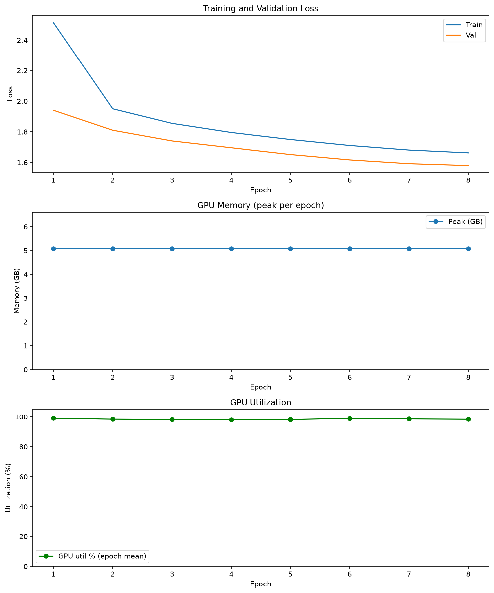

# NanoLLM — Tiny Language Model Trainer

A GPT-2 style transformer trained on [TinyStories](https://huggingface.co/datasets/roneneldan/TinyStories), built from scratch in PyTorch. Beyond the model itself it includes **custom fused CUDA LayerNorm kernels with a hand-written backward pass**, **multi-GPU training via DDP/FSDP**, **Weights & Biases tracking**, an Nsight Compute profiling pipeline, and scripts to provision and train on GCP.

---

## Project Structure

```
LLMs/
├── NanoLLM.py                # Model: batched MHA, weight tying, KV-cache generation
├── fused_ln.py               # FusedLayerNorm module + autograd + torch.library registration
├── main.py                   # Training loop: DDP/FSDP, W&B, checkpoint/resume
├── config.py                 # Dataclass config, fully overridable from the CLI
├── data.py                   # Streaming tokenisation + memmap batching
├── CrossEntropyLoss.py       # Hand-rolled cross-entropy (fp32 reduction)
├── TinyStories.py            # Dataset downloader
│
├── fused_layernorm_train.cu  # Production kernels: fwd + bwd, fp32/bf16/fp16
├── fused_layernorm.cu        # Benchmark kernels V1 (naive) + V2 (Welford + shuffle)
├── fused_layernorm_v3.cu     # Benchmark kernel V3 (float4 + two-level shuffle)
├── test_layernorm.py         # Correctness (fwd+bwd, fp32+bf16) and benchmarks
├── profile_run.py            # ncu profiling harness
│
├── gcp/                      # Provision a GPU VM, sync, train, fetch results
└── kaggle_run/               # Run DDP on Kaggle's free 2x T4
```

---

## Results

Trained on **2× NVIDIA Tesla T4** (Kaggle) with PyTorch DDP.

| | |
|---|---|
| Model | 30,044,544 params — 384 dim, 6 heads, 6 blocks, context 256 |
| Hardware | 2× Tesla T4 (sm_75), NCCL DDP, `world_size=2` |
| Precision | fp16 + GradScaler (auto-fallback from bf16 — Turing has no hardware bf16) |
| Data | 478M train / 4.8M val tokens (TinyStories) |
| Steps | 32,000 (8 epochs × 4,000), 12,288 tokens/step ≈ **393M tokens** |
| Wall clock | **111.6 min** (~785 s/epoch) |
| Throughput | **59.7k tokens/sec** |
| Peak memory | 5.08 GB / GPU (of 15 GB) |
| GPU utilization | ~99% |

Loss decreased monotonically with no overfitting — validation tracked training throughout:

| Epoch | 1 | 2 | 3 | 4 | 5 | 6 | 7 | 8 |
|---|---|---|---|---|---|---|---|---|
| Train | 2.5140 | 1.9505 | 1.8552 | 1.7957 | 1.7500 | 1.7110 | 1.6810 | **1.6626** |
| Val | 1.9408 | 1.8104 | 1.7406 | 1.6961 | 1.6517 | 1.6167 | 1.5920 | **1.5799** |

**Final validation perplexity: 4.85.** The model had not plateaued — further epochs would still improve it.



### Sample output

Prompted with `"Once upon a time"`, temperature 0.8, top-k 200:

> Once upon a time, there was a little girl named Lily. She loved to play outside in the sunshine. One day, she found a shiny rock on the ground. It was so pretty! She put it in her pocket and continued walking.
>
> As she walked, she saw a big, bossy dog. The dog wanted to take the rock away. Lily didn't...

Generations end stories cleanly at `<|endoftext|>` — the model learned document boundaries because `TinyStories.py` writes an explicit separator between stories.

### DDP scaling

Measured on the same 2× T4, identical workload, per-device batch held constant (weak scaling — the correct measurement for data parallelism, since the point is to process more tokens per unit time):

| GPUs | Throughput | Speedup | Efficiency |
|---|---|---|---|
| 1 | 35,300 tok/s | 1.00× | — |
| 2 | 64,500 tok/s | **1.83×** | **91%** |

91% at 2 GPUs is healthy. The missing 9% is gradient all-reduce, which is a fixed cost per step that does not shrink as you add devices — T4s are PCIe-connected with no NVLink, so this is roughly the ceiling for this interconnect.

Reproduce with `./kaggle_run/push.sh --benchmark`.

### Experiment tracking

3,200 logged steps across 166 metrics, including per-tensor gradient and parameter histograms for every block, throughput, and GPU telemetry. Logged offline on Kaggle and synced afterwards with `wandb sync`.

---

## Model Architecture

| Component | Detail |
|---|---|
| Type | GPT-2 style decoder-only transformer |
| Vocabulary | GPT-2 BPE via tiktoken (50,257 tokens) |
| Context length | 256 tokens |
| Embedding dim | 384 |
| Attention heads | 6 |
| Transformer blocks | 6 |
| Attention | Fused QKV projection + `scaled_dot_product_attention` (FlashAttention) |
| Activation | GELU (tanh approximation) |
| Weight tying | `lm_head` shares the token embedding |
| LayerNorm | Custom fused CUDA kernel (forward **and** backward) |

The defaults are larger than a "toy" config on purpose: at 128-dim/4-layer a multi-GPU run is dominated by launch and gradient-sync overhead, so DDP shows *negative* scaling. Every value is a CLI flag, so `--num_embeddings=128 --num_blocks=4` restores the original size.

---

## Custom CUDA LayerNorm

### Production kernel (`fused_layernorm_train.cu`)

This is the one that actually runs during training. It is templated on the scalar type and implements the full autograd triple:

| Kernel | Parallelisation |
|---|---|
| `ln_fwd_kernel` | One row per `threadIdx.y` slot, single-pass Welford, 16-byte vector loads, two-level warp-shuffle reduction. Saves `mean`/`rstd` for the backward pass. |
| `ln_bwd_dx_kernel` | Row-parallel; two reductions per row (`sum(dxhat)`, `sum(dxhat·xhat)`). |
| `ln_bwd_dwdb_partial_kernel` | Column-parallel tiles over a 2D grid, partials summed on the host. |

Activations may be fp32/bf16/fp16; **gamma, beta and every accumulator stay float32**, because reducing a 384-wide row in bf16 loses far too much precision.

### Benchmark progression (`fused_layernorm.cu`, `fused_layernorm_v3.cu`)

Kept because the optimisation story is the point of the exercise — forward-only, float32.

| Version | Technique |
|---|---|
| **V1** | Shared-memory tree reduction, two passes (mean, then variance) |
| **V2** | Welford online algorithm + `__shfl_down_sync` warp shuffle |
| **V3** | float4 vectorised loads + two-level warp shuffle + multi-row blocks |

Forward-only latency, B=512, **measured on a Tesla T4 (sm_75)**:

| Kernel | N=128 | N=768 |
|---|---|---|
| V1 Naive | 16.8 µs | 154.1 µs |
| V2 Welford | **16.0 µs** | 206.1 µs |
| V3 float4 | 58.5 µs | 63.0 µs |
| Production fp32 | 40.0 µs | **44.6 µs** |
| PyTorch LN | 25.7 µs | 28.3 µs |

Forward + backward, fp16, B=512: fused **643 µs** vs PyTorch **245 µs**.

**Read this honestly: the production kernel is currently ~1.6× slower than PyTorch's LayerNorm on a T4, and ~2.6× slower on forward+backward.** PyTorch's `native_layer_norm` is a heavily tuned kernel with a fused backward; this one splits the backward into a `dx` pass plus a separate column-reduction pass for `dgamma`/`dbeta`, so it moves more memory. The V1→V2→V3 progression still shows the optimisation techniques working relative to each other (V3 is 2.4× faster than V1 at N=768, and V2 is fastest of all at N=128), but "beats PyTorch" is not a claim this data supports on this hardware.

One real bug was found and fixed by measuring: the launch config was hard-coded to 256 threads × 4 rows regardless of `N`. At N=128 with 4-wide vectors a row is only 32 vector elements, so **224 of 256 threads idled** and the cross-warp reduction ran over 8 warps with 7 empty. Sizing the block to the row (`pick_launch_config`) gave 1.5–1.75×.

> **Note on the original benchmark claim.** The old `FusedLayerNorm` only dispatched to a custom kernel for `float32` inputs. Training runs under `torch.autocast(bfloat16)`, so in practice *every* LayerNorm silently fell back to `F.layer_norm` and the kernels never ran outside the benchmark script. The production kernel above fixes this; `main.py` prints which path is live at startup.

Run the suite (needs an NVIDIA GPU):

```bash
python test_layernorm.py           # correctness (fwd+bwd, fp32+bf16) + benchmarks
python test_layernorm.py --quick   # correctness only
```

---

## Training

### 1. Install

```bash
python -m venv .venv && source .venv/bin/activate
pip install -r requirements.txt
sudo apt install ninja-build     # required to JIT-compile the CUDA extension
```

### 2. Download the dataset

```bash
python TinyStories.py            # writes train.txt and val.txt
```

Stories are separated by an explicit `<|endoftext|>` marker so the model can learn where a story ends.

### 3. Train

```bash
# Single GPU
python main.py

# Two GPUs on one node
torchrun --standalone --nproc_per_node=2 main.py

# Multi-node
torchrun --nnodes=2 --node_rank=0 --master_addr=<host> --nproc_per_node=2 main.py
```

Any config field is a flag:

```bash
torchrun --standalone --nproc_per_node=2 main.py \
    --num_epochs=10 --batch_size=64 --grad_accum_steps=4 --wandb_mode=offline
```

On first run `train.txt`/`val.txt` are tokenised into `train.bin`/`val.bin`. A sidecar `.meta.json` records the source size and mtime, so edits to the text are detected and re-tokenised rather than silently ignored.

### Training details

- **Distribution**: DDP (default) or FSDP (`--strategy=fsdp`). Gradient accumulation uses `no_sync` on all but the final micro-step, so accumulation does not multiply communication.
- **Optimiser**: AdamW (fused when available) with GPT-2 parameter grouping — decay on matmul weights only, none on biases/LayerNorm gains.
- **LR schedule**: linear warmup then cosine decay, stepped **per optimizer step**.
- **Precision**: bf16 autocast by default. fp16 additionally enables a `GradScaler`; bf16 does not need one.
- **Gradient clipping**: `max_norm=1.0` (FSDP-aware).
- **Checkpointing**: `checkpoints/last.pt` every epoch and `checkpoints/best_model.pt` on val improvement. Resume with `--resume=auto`.
- **Compilation**: `torch.compile` on by default. The kernels are registered through `torch.library` with fake tensors, so Dynamo traces through them instead of breaking the graph at every LayerNorm.

### Configuration

See `config.py` for the full list, or `python main.py --help`.

---

## Experiment tracking (W&B)

```bash
wandb login                      # once
python main.py --wandb_project=nanollm --wandb_run_name=baseline
```

Logged: train/val loss and perplexity, learning rate, gradient norm, **tokens/sec and ms/step**, GPU memory (allocated / peak / reserved), GPU utilisation, weight and gradient histograms, and a generated text sample at the end of training.

`--wandb_mode=offline` records locally (sync later with `wandb sync`); `--wandb_mode=disabled` turns it off. TensorBoard remains available via `--use_tensorboard=true`.

Throughput is the metric that makes the multi-GPU claim concrete — compare `perf/tokens_per_sec` between a `--nproc_per_node=1` and `--nproc_per_node=2` run.

---

## Training on GCP

Scripts in `gcp/` provision a GPU VM and run the job. Settings live in `gcp/env.sh`; `NUM_GPUS` picks the machine shape (1→`g2-standard-8`, 2→`g2-standard-24`, 4→`g2-standard-48`).

```bash
./gcp/check_quota.sh          # effective quota + status of your requests
./gcp/create_vm.sh            # create VM (+ checkpoint bucket)
./gcp/sync_and_train.sh       # push code, install deps, launch torchrun
./gcp/logs.sh                 # tail the training log
./gcp/scaling_benchmark.sh    # tokens/sec across 1, 2, 4 GPUs
./gcp/fetch_results.sh        # pull checkpoints and plots into ./artifacts
./gcp/delete_vm.sh            # tear down (GPUs bill while RUNNING)
```

**GPU choice.** L4 (Ada, sm_89), not T4 — T4 is Turing (sm_75) and has **no hardware bf16**, which is the dtype this trains in. L4 is the cheapest GCP GPU with native bf16.

**Quota.** Two Compute Engine quotas gate this and **both** must be raised:

| Quota | Scope | Default |
|---|---|---|
| `GPUS_ALL_REGIONS` | global | **0** — blocks every GPU VM, even a single-GPU one |
| `NVIDIA_L4_GPUS` | per region | 1 in every region |

A grant on one alone changes nothing. `./gcp/check_quota.sh` reports effective limits *and* the approve/deny status of requests you have filed; `gcp/QUOTA_REQUEST.md` has step-by-step instructions and justification text (a blank justification is a common denial cause).

Spot is off by default because it draws on a separate `PREEMPTIBLE_NVIDIA_L4_GPUS` quota; set `SPOT=1` once that is granted. The loop checkpoints every epoch and supports `--resume=auto`, so reclamation costs at most one epoch.

### Demonstrating the multi-GPU claim

`./gcp/scaling_benchmark.sh` runs a fixed workload at 1, 2 and 4 GPUs and reports tokens/sec, speedup and scaling efficiency. Per-device batch size is held constant so the global batch grows with GPU count — weak scaling, which is the correct measurement for data parallelism.

---

## Training on Kaggle (free 2× T4)

Kaggle notebooks provide **2× NVIDIA T4** free (~30 GPU-hours/week, 9–12 h per session), which is enough for real DDP.

```bash
pip install kaggle
kaggle auth login                 # or export KAGGLE_API_TOKEN=...

./kaggle_run/push.sh              # package source -> Dataset, push + run kernel
./kaggle_run/push.sh --status     # run state
./kaggle_run/push.sh --logs       # kernel logs
./kaggle_run/push.sh --fetch      # download checkpoints into ./artifacts
```

The repo is uploaded as a private Kaggle **Dataset** and attached to a **script kernel** (`kaggle_run/run_kaggle.py`), which stages the source, downloads TinyStories, and runs `torchrun --nproc_per_node=2 main.py`.

**T4 has no hardware bf16.** T4 is Turing (sm_75); bf16 needs sm_80+. `main.py` detects the compute capability and automatically falls back to **fp16 + GradScaler**, which Turing does accelerate. You will see this in the log:

```
[precision] Tesla T4 is sm_75: no hardware bf16. Falling back to float16 + GradScaler.
```

Practical notes:

- **Set the accelerator to "GPU T4 x2" in the Kaggle UI on the first run.** Kaggle's machine-shape enum is not published in the SDK (`kaggle/api/kaggle_api_extended.py` even says so), so `enable_gpu` alone may give a single P100. The UI setting persists across later pushes. Override with `ACCELERATOR=... ./kaggle_run/push.sh` if you know the string.
- **Enable Internet** on the kernel — required to download TinyStories and pip-install.
- Add a `WANDB_API_KEY` Kaggle Secret to log online; otherwise W&B runs offline and the run directory comes back in the kernel output.
- Data lands in `/kaggle/temp` (scratch), checkpoints in `/kaggle/working` (downloadable). Leaving the ~3 GB dataset in the output would make every run slow to upload.
- `--resume=auto` is passed, so re-running continues from the last checkpoint if you re-attach it.

---

## Profiling with Nsight Compute

```bash
sudo sh -c 'echo 0 > /proc/sys/kernel/perf_event_paranoid'

# Forward
sudo -E $(which ncu) --set full --kernel-name regex:ln_fwd_kernel \
    -o nanollm_fwd $(which python) profile_run.py

# Backward
sudo -E $(which ncu) --set full --kernel-name regex:ln_bwd \
    -o nanollm_bwd $(which python) profile_run.py --backward

ncu-ui nanollm_fwd.ncu-rep
```

`profile_run.py` never uses `torch.compile` (it breaks ncu kernel replay) and drives the kernel directly so nothing can quietly fall back to `F.layer_norm`. `--dtype` selects the precision to profile; NVTX ranges label each region.

---

## Requirements

- Python 3.9+
- PyTorch 2.4+ with CUDA (bf16 kernels need sm_80 or newer)
- `ninja-build` for JIT CUDA compilation
- See `requirements.txt`

---

## License

MIT License

## Acknowledgments

- [TinyStories dataset](https://huggingface.co/datasets/roneneldan/TinyStories) by Eldan & Li
- GPT-2 architecture and tiktoken tokeniser by OpenAI
